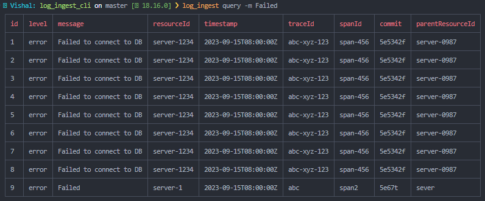

# Log Ingestion CLI

## Description

A log ingestor cli that reads a log file and sends the data to a server.<br />
Can be used to ingest logs using values as well as from a JSON file.<br />
You can query the server for the logs that have been ingested.

## Installation

Install the package using npm

```bash
npm install -g log_ingest
```

After installing the package, you need to set the server url.

```bash
log_ingest specs --url <server-url>
```

**Note:** The server url should be in the format `http://<host>:<port>`, where avoid using `localhost` as the host name, instead use the IP address of the machine.

## Usage

For testing you can clone and run the server from [here](https://github.com/VishalZ123/Log-Ingestor)

### Ingesting logs

Logs can be ingested using the command line as well as from a JSON file.

```bash
log_ingest ingest --level <level> --message <message> --resourceId <resourceId>  --timestamp <timestamp> --traceId <traceId> --spanId <spanId> --commit <commit> --metadata_parentResourceId <metadata_parentResourceId>
```

or use aliases

```bash
log_ingest ingest -l <level> -m <message> --rid <resourceId>  --ts <timestamp> --tid <traceId> --sid <spanId> -c <commit> -prid <metadata_parentResourceId>
```

Ingesting logs from a JSON file

```bash
log_ingest ingest --file <path-to-file>
or
log_ingest ingest -f <path-to-file>
```

Example of a JSON file

```json
[
  {
    "level": "error",
    "message": "Failed to connect to DB",
    "resourceId": "server-1234",
    "timestamp": "2023-09-15T08:00:00Z",
    "traceId": "abc-xyz-123",
    "spanId": "span-456",
    "commit": "5e5342f",
    "metadata": {
      "parentResourceId": "server-0987"
    }
  },
  {
    "level": "info",
    "message": "Connected to DB",
    "resourceId": "server-1234",
    "timestamp": "2023-09-15T08:00:00Z",
    "traceId": "abc-xyz-123",
    "spanId": "span-456",
    "commit": "5e5342f",
    "metadata": {
      "parentResourceId": "server-0987"
    }
  }
]
```

### Querying logs

You can query the server for the logs that have been ingested.<br />
The arguments are the same as the ones used for ingesting logs, but they are **optional**.

```bash
log_ingest query --level <level> --message <message> --resourceId <resourceId>  --timestamp <timestamp> --traceId <traceId> --spanId <spanId> --commit <commit> --metadata_parentResourceId <metadata_parentResourceId>
```

or use aliases

```bash
log_ingest query -l <level> -m <message> --rid <resourceId>  --ts <timestamp> --tid <traceId> --sid <spanId> -c <commit> -prid <metadata_parentResourceId>
```

Get all logs

```bash
log_ingest query --all
```

**Example:**



### Help

```bash
log_ingest --help
```

## License
[ISC](https://choosealicense.com/licenses/isc/)

---